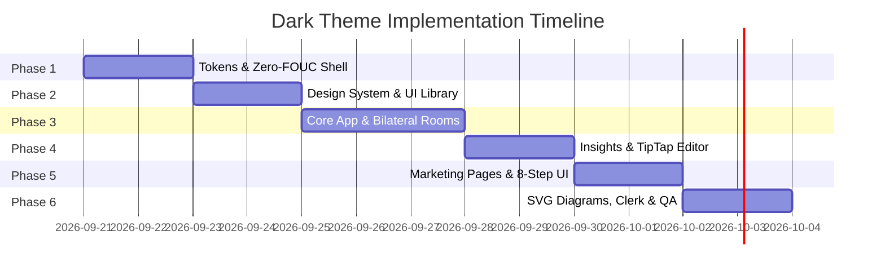

# The Relay — System-Wide Dark Theme Architecture & Implementation Plan

> **Document Version:** 1.0  
> **Target Application:** The Relay UI (`@tanstack/react-start`, `Tailwind CSS v4`, `@clerk/tanstack-react-start`)  
> **Status:** Architectural Planning / Pre-Implementation  

---

## 1. Executive Summary & Strategic Approach

This document outlines the architectural blueprint, design token mapping, edge-case mitigation strategies, and phased effort estimation for implementing a system-wide Dark Theme across **The Relay**.

### Core Objectives
1. **Operator-Grade Aesthetic:** Maintain the high-trust, institutional, "Bloomberg-meets-Linear" aesthetic without using generic pitch-black backgrounds.
2. **Zero Flash of Unstyled Theme (Zero-FOUC):** Eliminate light-mode flash on server-rendered routes before client-side hydration.
3. **Seamless Multi-Engine Consistency:** Ensure all parts of the application (Public Marketing, Deal Discovery, Bilateral Escrow Negotiation Rooms, Insights Knowledge Hub, TipTap Editor, and Clerk Auth) share consistent visual depth.
4. **Non-Breaking Incremental Migration:** Design the token layer so light mode remains 100% pixel-faithful while dark mode activates gracefully.

---

## 2. Design Token System & Elevation Hierarchy

Rather than relying on flat `#000000`, the dark theme uses an **Operator Slate Elevation Hierarchy** with 4 distinct surface tiers:

```
┌──────────────────────────────────────────────────────────┐
│  Tier 3: Inset Wells & Code Blocks (#0E1420 / 9% lightness) │
│  ┌────────────────────────────────────────────────────┐  │
│  │  Tier 2: Elevated Dialogs & Menus (#1A2438 / 16%)  │  │
│  │  ┌──────────────────────────────────────────────┐  │  │
│  │  │  Tier 1: Cards & Panels (#131B2B / 12%)      │  │  │
│  │  │  ┌────────────────────────────────────────┐  │  │  │
│  │  │  │  Tier 0: Base Canvas (#0B0F17 / 7%)     │  │  │  │
│  │  │  └────────────────────────────────────────┘  │  │  │
│  │  └──────────────────────────────────────────────┘  │  │
│  └────────────────────────────────────────────────────┘  │
└──────────────────────────────────────────────────────────┘
```

### Color Mapping Table

| Semantic Token | Light Mode (Default) | Dark Mode (Target) | Hex Reference | Primary Context |
| :--- | :--- | :--- | :--- | :--- |
| `--background` | `hsl(0 0% 100%)` | `hsl(222 47% 7%)` | `#0B0F17` | Main page body, app viewport |
| `--foreground` | `hsl(215 25% 12%)` | `hsl(210 40% 98%)` | `#F8FAFC` | Headings, primary text |
| `--card` | `hsl(0 0% 100%)` | `hsl(217 33% 12%)` | `#131B2B` | Cards, opportunity listings, containers |
| `--card-foreground` | `hsl(215 25% 12%)` | `hsl(210 40% 98%)` | `#F8FAFC` | Card titles and body |
| `--popover` | `hsl(0 0% 100%)` | `hsl(217 33% 16%)` | `#1A2438` | Dropdowns, modals, tooltips |
| `--popover-foreground` | `hsl(215 25% 12%)` | `hsl(210 40% 98%)` | `#F8FAFC` | Popover text |
| `--primary` | `hsl(24 95% 45%)` | `hsl(24 95% 50%)` | `#EE5A08` | Operator Orange primary action buttons |
| `--primary-foreground` | `hsl(0 0% 100%)` | `hsl(0 0% 100%)` | `#FFFFFF` | Text on primary buttons |
| `--secondary` | `hsl(210 15% 94%)` | `hsl(217 33% 18%)` | `#1E293B` | Secondary buttons, subtle pill badges |
| `--secondary-foreground` | `hsl(215 25% 12%)` | `hsl(210 40% 95%)` | `#F1F5F9` | Text on secondary elements |
| `--muted` | `hsl(215 15% 45%)` | `hsl(215 20% 65%)` | `#94A3B8` | Subtitles, labels, metadata |
| `--muted-foreground` | `hsl(215 15% 45%)` | `hsl(215 20% 65%)` | `#94A3B8` | Placeholder text, inactive tabs |
| `--border` | `hsl(215 25% 12% / 0.12)` | `hsl(217 33% 22% / 0.8)` | `#243048` | Dividers, card strokes, table lines |
| `--input` | `hsl(215 25% 12% / 0.12)` | `hsl(217 33% 22% / 0.8)` | `#243048` | Input border, select borders |
| `--ring` | `hsl(24 95% 45%)` | `hsl(24 95% 50%)` | `#EE5A08` | Focus ring outline |
| `--accent-emerald` | `#059669` (emerald-600) | `#34D399` (emerald-400) | `#34D399` | Verification seals, KYB badges |

---

## 3. Technical Implementation Architecture

### 3.1 CSS Structure (Tailwind v4)
`src/styles.css` is already set up with:
```css
@import "tailwindcss" source(none);
@source "../src";
@custom-variant dark (&:is(.dark *));
```

The next step will define the `.dark` class block matching the semantic variables:
```css
.dark {
  --background: hsl(222 47% 7%);
  --foreground: hsl(210 40% 98%);
  --card: hsl(217 33% 12%);
  --card-foreground: hsl(210 40% 98%);
  --popover: hsl(217 33% 16%);
  --popover-foreground: hsl(210 40% 98%);
  --primary: hsl(24 95% 50%);
  --primary-foreground: hsl(0 0% 100%);
  --secondary: hsl(217 33% 18%);
  --secondary-foreground: hsl(210 40% 95%);
  --muted: hsl(215 20% 65%);
  --muted-foreground: hsl(215 20% 65%);
  --accent: hsl(24 95% 50%);
  --accent-foreground: hsl(0 0% 100%);
  --destructive: hsl(0 84% 60%);
  --destructive-foreground: hsl(0 0% 100%);
  --border: hsl(217 33% 22% / 0.8);
  --input: hsl(217 33% 22% / 0.8);
  --ring: hsl(24 95% 50%);
}
```

### 3.2 Zero-FOUC (Flash of Unstyled Theme) Engine
To prevent the client from flashing white on dark mode during initial SSR render, `src/routes/__root.tsx` will receive an inline execution script inside `RootShell`:

```html
<script dangerouslySetInnerHTML={{
  __html: `
    (function() {
      try {
        var stored = localStorage.getItem('relay-theme');
        var isDark = stored === 'dark' || (!stored && window.matchMedia('(prefers-color-scheme: dark)').matches);
        if (isDark) {
          document.documentElement.classList.add('dark');
        } else {
          document.documentElement.classList.remove('dark');
        }
      } catch (e) {}
    })();
  `
}} />
```

### 3.3 Theme Context & Controls
- **Location:** `src/lib/theme-provider.tsx`
- **Supported Modes:** `light`, `dark`, `system`
- **Toggle Components:**
  - Desktop Navbar Sun/Moon toggle button.
  - Mobile Sheet drawer theme selector.
  - Account/Settings profile preference synchronization.

---

## 4. Critical Edge Cases & Risk Mitigation

```
┌────────────────────────────────────────────────────────────────────────┐
│                        CRITICAL EDGE CASES                             │
├──────────────────┬─────────────────────────────────────────────────────┤
│ 1. Clerk Auth    │ Pass dark appearance theme dynamically to Clerk     │
│ 2. TipTap Editor │ Custom CSS rules for dark markdown prose & tables   │
│ 3. SVG Diagrams  │ Dual-state SVG fills / CSS variable-based styling   │
│ 4. Inverted UI   │ Prevent light-mode black cards disappearing in dark │
│ 5. Toast System  │ Sonner toast theme synchronization with theme state │
│ 6. Brand Logos   │ High-contrast SVG/PNG logo mask for dark header     │
└──────────────────┴─────────────────────────────────────────────────────┘
```

### 4.1 Clerk Authentication Styling
* **Problem:** Clerk's embedded modals (`<SignInButton>`, User Profile modal) default to a light appearance unless instructed otherwise.
* **Solution:** Import `dark` from `@clerk/themes` and conditionally supply it to `<ClerkProvider appearance={{ baseTheme: theme === 'dark' ? dark : undefined }}>`.

### 4.2 TipTap Rich Text Editor & Content Renderers
* **Problem:** In `src/styles.css` (lines 255-409), `.tiptap` styles currently use hardcoded light values:
  - Heading colors: `color: hsl(215 25% 12%)`
  - Table header backgrounds: `background-color: hsl(210 15% 96%)`
  - Code block styling: `background-color: hsl(215 25% 12%)`
* **Solution:** Introduce explicit `.dark .tiptap` selectors for:
  - Headings (`h1`, `h2`, `h3` -> `hsl(210 40% 98%)`)
  - Table headers (`th` -> `hsl(217 33% 18%)`)
  - Table cell borders (`td`, `th` -> `hsl(217 33% 24%)`)
  - Blockquotes background & text (`color: hsl(215 20% 75%)`, `bg: hsl(24 95% 45% / 0.1)`)
  - Image borders & captions.

### 4.3 SVG Illustrations & Interactive Diagrams
* **Problem:** `src/components/journey-illustrations.tsx` contains 8 SVG diagrams with hardcoded fills (`#FFFFFF`, `#F8FAFC`, `#0F172A`, `#E2E8F0`).
* **Solution:** 
  - Standardize SVG backgrounds using semantic fill classes (`fill-slate-100 dark:fill-slate-800`).
  - Use `stroke-current text-slate-300 dark:text-slate-700` for grid patterns and container bounds.

### 4.4 Inverted / Dark-Highlighted Elements
* **Problem:** In light mode, some cards (e.g., Step 7 & 8 on the journey timeline, or active filter tags) use `bg-slate-950 text-white`. In dark mode, pure black on dark canvas produces low contrast or visual sinking.
* **Solution:** In dark mode, elevate highlighted cards to `dark:bg-slate-900 dark:border-emerald-500/40 dark:ring-1 dark:ring-emerald-500/20` with bright text to create a vibrant halo effect.

### 4.5 Sonner Toasts & Dialog Overlays
* **Problem:** Toaster has hardcoded backgrounds in `src/styles.css` (`.toaster .toast[data-type="success"]`).
* **Solution:** Update toaster to use dynamic CSS variables (`--color-popover`, `--color-border`) and pass `theme={resolvedTheme}` to `<Toaster />`.

---

## 5. Scope & Component Inventory Matrix

Across **30 route files** and **115+ UI components**, the migration scope is classified into 5 primary groups:

| Category | Key Files / Paths | Volume | Complexity |
| :--- | :--- | :--- | :--- |
| **1. Design Tokens & Primitives** | `src/styles.css`, `src/design-system/*`, `src/components/ui/*` | ~55 files | Medium |
| **2. Shell & Navigation** | `src/routes/__root.tsx`, `src/components/navbar.tsx`, `notifications-dropdown.tsx`, `user-avatar-dropdown.tsx` | 5 files | Medium |
| **3. Marketing & Protocol Pages** | `src/routes/home.tsx`, `core-pillars.tsx`, `8-step-journey.tsx`, `network.tsx` | 4 routes | High |
| **4. Marketplace & Exchange Room** | `opportunities.*.tsx`, `post.tsx`, `connections.$id.tsx`, `proposals.tsx`, `my-relay.tsx` | 8 routes | High |
| **5. Insights & TipTap Knowledge Hub** | `insights.*.tsx`, `KnowledgeEditorWorkspace.tsx`, `QuestionRichTextEditor.tsx`, `AskQuestionDialog.tsx` | 9 files | High |

---

## 6. Phased Implementation Roadmap & Effort Estimation



### Effort Breakdown

| Phase | Scope of Work | Estimated Time |
| :--- | :--- | :--- |
| **Phase 1: Token Engine & Core Shell** | Setup `.dark` CSS tokens in `styles.css`, implement `ThemeProvider`, zero-FOUC script in `__root.tsx`, and Navbar Sun/Moon toggle. | **2 Days** |
| **Phase 2: Design System & Primitive Components** | Audit and refactor `src/design-system/*` (`cards.tsx`, `inputs.tsx`, `modal.tsx`, `badges.tsx`) and `src/components/ui/*` (47 files). | **2 Days** |
| **Phase 3: Core Marketplace & Bilateral Workflows** | Convert `opportunities.index.tsx`, `post.tsx` multi-step wizards, `connections.$id.tsx` bilateral negotiation room, and `my-relay.tsx`. | **3 Days** |
| **Phase 4: Insights Knowledge Hub & TipTap Editor** | Refactor TipTap editor styling, prose rendering, question dialogs, markdown tables, and comment threads. | **2 Days** |
| **Phase 5: Public Pages & 8-Step Bilateral Journey** | Update `home.tsx` landing sections, `core-pillars.tsx` carousels, and `8-step-journey.tsx` timeline. | **2 Days** |
| **Phase 6: SVG Illustrations, Clerk Auth & QA Polish** | Refactor `journey-illustrations.tsx` SVGs, Clerk dark theme integration, WCAG AA contrast audit, and cross-browser testing. | **2 Days** |
| **Total Estimated Effort** | **Full System-Wide Dark Theme Delivery** | **13 Engineering Days** |

---

## 7. QA & Acceptance Checklist

- [ ] **Zero-FOUC:** Refreshing in dark mode never displays a white flash on any route.
- [ ] **Contrast Compliance:** All text meets WCAG AA (minimum 4.5:1 for normal text, 3:1 for large text).
- [ ] **Form States:** Inputs, textareas, dropdowns, and checkboxes have crisp, visible borders and clear focus rings in dark mode.
- [ ] **Bilateral Room State Clarity:** Masked vs unmasked states in `connections.$id.tsx` remain visually distinct and intuitive.
- [ ] **TipTap Editor:** Text formatting, code blocks, bullet points, and tables are fully legible in dark theme.
- [ ] **Modal & Drawer Overlays:** Backdrops darken correctly without light halos or clipping.
- [ ] **Clerk Dialogs:** Auth popups match application dark palette.
- [ ] **Persistent State:** User's theme selection persists across browser reloads and syncs with system preferences when set to `system`.
