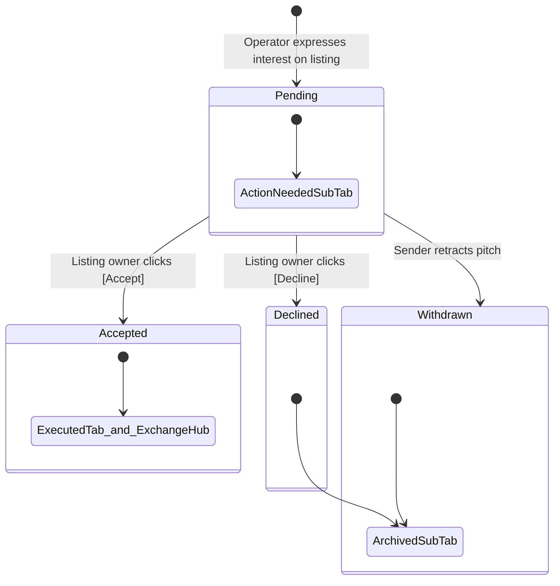

# Relay Incoming Requests (`/my-relay?tab=incoming`) — Architecture & Technical Summary
# Don't complicate the design and don't make it complex. The UI/UX should be easy for the user to understand make it no too complex like Apollo and not too simple like a facebook or instagram. 
## 1. Overview & Core Concept
The **Incoming Requests** tab is the centralized inbound deal pipeline in `/my-relay`. It allows business operators to review, manage, and respond to incoming pitches and handshake requests submitted by other verified businesses on their posted opportunities.

### Core Philosophy & Routing Rules:
- **Strictly In-Progress / Actionable Workflows:** Only incoming requests that are currently pending action or archived (declined/withdrawn) are displayed here.
- **Handshake Execution Transition:** Once an incoming request is **Accepted**, it transitions out of the Incoming tab and moves directly to **Executed Deals** (`/my-relay?tab=executed`) and the bilateral **Exchange Hub** (`/connections/:id`).

---

## 2. State & Sub-Filter Architecture

The tab contains a segmented sub-filter toggle with live count indicators:

```
┌────────────────────────────────────────────────────────┐
│ Active Inbound Handshakes                              │
│ Review pitches sent by other businesses on your listings│
│                                                        │
│   [ Action Needed (3) ]   [ Archived (1) ]             │
└────────────────────────────────────────────────────────┘
```

### 1. `Action Needed` (`incomingSubFilter === "pending"`)
- **Query Filter:** `incomingRequests.filter((r) => r.status === "pending")`
- **Purpose:** Highlights inbound pitches awaiting an explicit affirmative action (`Accept`) or dismissal (`Decline`).
- **Empty State:** `Inbox Zero — No Pending Handshakes` — displays when all incoming requests have been reviewed and acted upon.

### 2. `Archived` (`incomingSubFilter === "archived"`)
- **Query Filter:** `incomingRequests.filter((r) => r.status === "declined" || r.status === "withdrawn")`
- **Purpose:** Retains an immutable audit trail of past pitches that were either declined by the listing owner or withdrawn by the sender before acceptance.
- **Empty State:** `No Archived Requests` — displays when no declined or withdrawn requests exist.

---

## 3. Data Flow & Lifecycle Management

### Server Functions & Services:
| Function | Route / Method | Service Layer | Description |
| :--- | :--- | :--- | :--- |
| `getIncomingRequests` | `GET` server function | `InterestService.getIncomingForBusinessIds()` | Fetches all incoming requests targeting opportunities owned by the user's business profile(s). |
| `acceptInterest` | `POST` server function | `InterestService.acceptInterest(interest_id)` | Verifies ownership, flips interest status to `accepted`, triggers connection room initialization, and reveals mutual contact details. |
| `declineInterest` | `POST` server function | `InterestService.declineInterest(interest_id)` | Flips status to `declined`, archiving the pitch and preventing further handshake progression. |

### Handshake Lifecycle State Machine:



---

## 4. UI Layout & Component Breakdown

### 1. Header & Controls Section
- **Title:** `Active Inbound Handshakes` (uppercase display font)
- **Subtitle:** Informative summary explaining incoming deal pitches
- **Filter Bar:** Segmented toggle for `Action Needed ({count})` and `Archived ({count})`

### 2. Inbound Request Card
Each item in the list renders a card detailing the prospective partner's pitch:

```
┌───────────────────────────────────────────────────────────────────────────┬───────────────────┐
│ Confidential Business  [Approved]  Received 2h ago  [Pending Your Review] │ [ Exchange Hub ]  │
│                                                                           │ [ Accept ]        │
│ ┌─ Your Listing ────────────────────────────────────────────────────────┐ │ [ Decline ]       │
│ │ Looking for SEO Agency / Shopify Dev Shop       [View Listing ->]     │ │                   │
│ └───────────────────────────────────────────────────────────────────────┘ │                   │
│                                                                           │                   │
│ 💬 Pitch Context                                                          │                   │
│ "We have 8 years experience scaling Shopify Plus stores to 8-figure GMV..." │                   │
└───────────────────────────────────────────────────────────────────────────┴───────────────────┘
```

#### Card Elements:
1. **Sender Identity & Confidentiality:**
   - Blinded as `"Confidential Business"` while in `pending` or `withdrawn` status.
   - Displays real company name once accepted or revealed.
   - Includes verification badge (e.g. `Approved` / `Verified`).
   - Relative timestamp (e.g., `Received 2 hours ago`).
2. **Listing Context Rail:**
   - Displays the target opportunity title posted by the user.
   - Deep-links to the full public listing view (`/opportunities?q=RY-XXXX`).
3. **Pitch Message Context:**
   - Italicized quote block containing the note or cover message written by the requesting business.
4. **Action Driver Rail (Right Column / Mobile Bottom):**
   - **`Exchange Hub` button:** Navigates directly to the dedicated bilateral exchange page (`/connections/$id`).
   - **`Accept` button:** Executes deal handshake, confirms acceptance, displays toast, and refreshes the data.
   - **`Decline` button:** Declines the inbound pitch and moves it to the `Archived` view.

---

## 5. Design System Alignment & Audit Checklist

To bring the **Incoming Requests** tab into 100% compliance with `design_system_components.md` and `tokens.ts`:

- [ ] **Action Buttons:**
  - Replace raw HTML `<button>` and custom inline styles with `@/design-system` `Button` component.
  - Remove button icons (text-only buttons as per design guidelines).
  - Use `font-sans font-semibold` across all button variants (`primary`, `authoritative`, `ghost`, `destructive`).
- [ ] **Sub-Filter Toggle:**
  - Refactor the segmented filter container to use design token border and surface colors (`#F1F5F9`, `#E2E8F0`, `#171F2C`).
- [ ] **Badges & Verification Chips:**
  - Replace custom status pill markup with `@/design-system` `VerifiedBadge` (`#ECFDF5` / `#065F46` / `#A7F3D0`).
  - Standardize status badges (e.g., `Pending Review`, `Declined`, `Withdrawn`) using system token palettes.
- [ ] **Card Containers & Typography:**
  - Standardize card borders to `#E2E8F0` with `rounded-[4px]`.
  - Replace lingering monospace overrides with clean `Inter` (`font-sans`) body text and labels.


## 9. Design System & Palette

| Role | Color | Hex |
|---|---|---|
| **Primary Black** | Pure / Near-Pure Black | `#000000` |
| **Dark Surface / Banner** | Charcoal | `#171F2C` |
| **White** | White | `#FFFFFF` |
| **Light Background** | Very Light Gray | `#F8FAFC` |
| **Border** | Light Gray | `#E2E8F0` |
| **Secondary Text** | Slate | `#64748B` |
| **Muted Text** | Muted Slate | `#94A3B8` |
| **Accent Orange** | Amber / Orange | `#F97316` / `#C2410C` |
| **Verified Green** | Emerald | `#059669` / `#ECFDF5` |