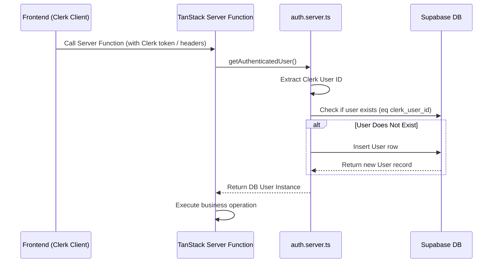

# 🏗️ The Relay — Backend Foundation Documentation

This document describes the design, setup, and configuration of the backend foundation built for **The Relay** business opportunity exchange.

---

## 📁 1. Project Structure

The files created and configured under the `src/` directory are structured as follows:

```
src/
├── db/
│   ├── migrations/
│   │   └── 01_init.sql          # SQL Schema: Tables, constraints, indexes, RLS, storage
│   └── supabase.ts              # Supabase Client Factory (Service Role & User Scoped)
├── types/
│   └── index.ts                 # TypeScript type definitions, DTOs, and enum variants
├── validators/
│   └── index.ts                 # Zod validation schemas for all inputs
├── services/
│   ├── email.service.ts         # Resend-ready transaction email sending placeholder
│   ├── user.service.ts          # UserService: User creation and Clerk sync
│   ├── business.service.ts      # BusinessService: Registration, profile edits, admin review
│   ├── opportunity.service.ts   # OpportunityService: Listing management, listings feed, saving
│   ├── interest.service.ts      # InterestService: Introduction pitches, reciprocity sync
│   └── notification.service.ts  # NotificationService: Read/unread indicators, system notices
├── functions/
│   ├── createBusiness.ts        # Server Function: Registers business
│   ├── updateBusiness.ts        # Server Function: Updates company info
│   ├── createOpportunity.ts     # Server Function: Creates a listing (locks for pending status)
│   ├── updateOpportunity.ts     # Server Function: Updates opportunity parameters
│   ├── expressInterest.ts       # Server Function: Pitch introduction (locks for pending status)
│   ├── approveBusiness.ts       # Server Function: Admin workflow to approve business profiles
│   ├── rejectBusiness.ts        # Server Function: Admin workflow to reject business profiles
│   ├── saveOpportunity.ts       # Server Function: Bookmark an opportunity listing
│   └── removeSavedOpportunity.ts# Server Function: Remove a bookmarked listing
└── lib/
    └── auth.server.ts           # Clerk user resolver & auto-provisioning middleware
```

---

## 🔑 2. Clerk Authentication & Auto-Provisioning Flow

Clerk is the absolute source of truth for user authentication. Database mapping uses `clerk_user_id` as the primary key.

### Login / Request Sync Hook

In `src/lib/auth.server.ts`, the `getAuthenticatedUser()` helper runs on the server inside Server Functions. It performs the following sequence on every authenticated call:



### Clerk Token Retrieval Hook

To execute calls to the backend from the React client:

```tsx
import { useAuth } from "@clerk/clerk-react";
import { createBusiness } from "~/functions/createBusiness";

function RegisterBusinessForm() {
  const { getToken } = useAuth();

  const handleSubmit = async (formData) => {
    // 1. Get raw Clerk JWT token
    const token = await getToken();

    // 2. Invoke TanStack Server Function with token in headers/context
    // In TanStack Start, you can pass headers via query context or an interceptor
    const response = await createBusiness({
      data: formData,
      headers: {
        Authorization: `Bearer ${token}`,
      },
    });
  };
}
```

---

## 🗄️ 3. Recommended Query Patterns

All database actions go through the Service Layer. Below are recommended query patterns utilizing `@supabase/supabase-js`.

### A. Dynamic Joins and Filtering (Opportunity Feed)

To filter listings by the parent business's industry, we utilize an inner join via the `!inner` directive in PostgREST:

```typescript
// From src/services/opportunity.service.ts
let query = supabase
  .from("opportunities")
  .select(filters.industry ? "*, business:businesses!inner(*)" : "*, business:businesses(*)");

if (filters.industry) {
  query = query.eq("business.industry", filters.industry);
}
```

### B. Transactional / Multi-Table Operations (Business Creation)

When registering a company profile, it is critical to record the creator as the owner in the membership table. If one fails, we manually delete/rollback:

```typescript
// From src/services/business.service.ts
const { data: business } = await supabase.from("businesses").insert(businessData).select().single();

const { error: memberError } = await supabase
  .from("business_members")
  .insert({ business_id: business.id, user_id: ownerId, role: "owner" });

if (memberError) {
  await supabase.from("businesses").delete().eq("id", business.id);
  throw new Error("Failed to insert membership");
}
```

---

## 🔒 4. Row Level Security (RLS) & Storage

We enabled RLS on all tables as a secondary defense layer, with the Service Layer carrying primary responsibility.

### Storage Configuration

Bucket name: `business-assets` (public read, server-side upload only).

1. **Bucket Creation**:
   ```sql
   INSERT INTO storage.buckets (id, name, public, file_size_limit, allowed_mime_types)
   VALUES ('business-assets', 'business-assets', true, 5242880, ARRAY['image/jpeg', 'image/png', 'image/webp']);
   ```
2. **Access Policies**:
   - **Public Read Access**: Allowed for anyone (`TO public`).
   - **Uploads**: Restricted to authenticated client profiles or Server Functions.
